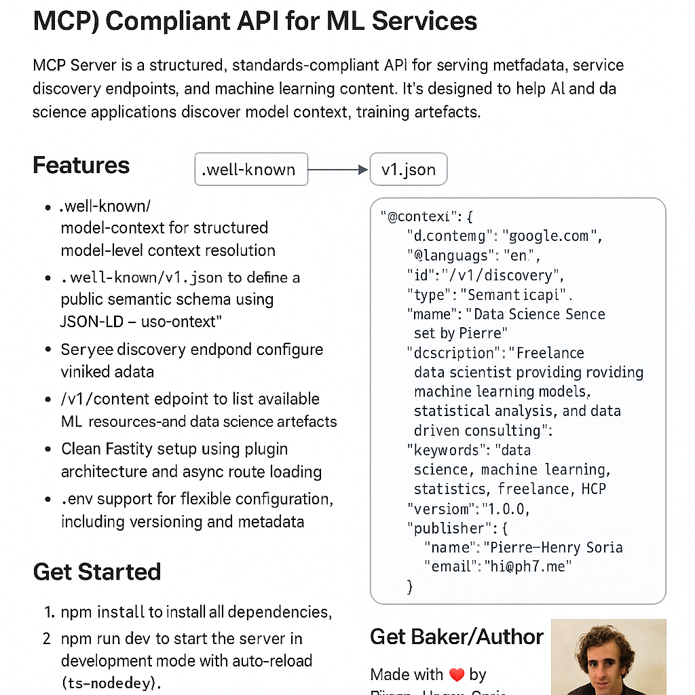

# My Personal Machine-Consumable Protocol (MCP) Compliant API for ML Services

MCP Server is a structured, standards-compliant API for serving metadata, service discovery endpoints, and machine learning content. It's designed to help AI and data science applications discover model context, training artefacts, research notebooks, and statistical methods efficiently.

This server follows the [MCP specification](https://www.modelcontext.org/spec) and is production-ready, built with clean TypeScript code and a modular design.

## Features 🚀

* `.well-known/model-context` for structured model-level context resolution
* `.well-known/v1.json` to define a public semantic schema using JSON-LD – this is your `@context` document, allowing linked data vocab reuse
* Service discovery endpoint at `/v1/discovery`
* `/v1/content` endpoint to list available ML resources and data science artefacts
* Clean Fastify setup using plugin architecture and async route loading
* `.env` support for flexible configuration, including versioning and metadata


## Get Started

1. `npm install` to install all dependencies.
2. `npm run dev` to start the server in development mode with auto-reload (`ts-node-dev`).
3. Copy `.env.dist` to `.env` and configure the variables to fit your environment.

### Other Commands

* `npm run start` – start the compiled server in normal mode (no hot reload)
* `npm run prod` – full production build and run (builds and launches)
* `npm run build` – compile TypeScript source code into `dist/` JavaScript

### Utility

* `npm run prettier:check` – check formatting issues using Prettier
* `npm run prettier:fix` – auto-format source files

## Environment Variables

The `.env` file supports the following values:

```env
PORT=3000
APP_VERSION=1.0.0
MCP_VERSION=1.0.0
MCP_NAME="Data Science Services by Pierre"
MCP_DESCRIPTION="Freelance data scientist providing machine learning models, statistical analysis, and data-driven consulting."
MCP_TAGS="data science,machine learning,statistics,freelance,MCP"
MCP_CONTACT_EMAIL=hi@ph7.me
MCP_CONTACT_WEBSITE=https://ph7.me
```

## Follow My MCP Journey

I regularly share updates, deep dives, and tutorials on **building MCP servers** and related AI infrastructure on social media:

* Bluesky: [https://bsky.app/profile/ph7s.bsky.social](https://bsky.app/profile/ph7s.bsky.social)
* X: [https://x.com/phenrysay](https://x.com/phenrysay)

Feel free to follow along, ask questions, and engage!

## What is an MCP Server?

A **Model Context Protocol (MCP) server** is not just another REST API. Rather than simply exposing data, it provides **machine-readable context and metadata** about your ML services or models—using linked data formats like JSON-LD.

Its core purpose is to expose structured discovery endpoints—typically under `.well-known/`—which allow AI agents and tooling ecosystems to understand your capabilities without needing human interpretation.

## How is MCP different from a normal API?

* **Purpose:** Normal APIs deliver functional data. MCP servers deliver semantic metadata.
* **Endpoints:** MCP uses `.well-known/model-context` and `v1.json` for semantic discovery.
* **Format:** All responses are structured as JSON-LD (not plain JSON), enabling interoperability and reuse across systems.
* **Consumers:** Designed for machines, not people—MCP endpoints target **AI agents, search engines, or distributed tools**.




## The Baker

[](https://ph7.me "Pierre-Henry Soria, Software Developer")

Made with ❤️ by **[Pierre-Henry Soria](https://pierrehenry.be)**. A super passionate & enthusiastic Problem-Solver / Senior Software Engineer. Also a true cheese 🧀, ristretto ☕️, and dark chocolate lover! 😋

[](https://x.com/phenrysay "Follow Me on X")  [](https://github.com/pH-7 "My GitHub")  [](https://youtube.com/@pH7Programming "YouTube SucceedAI Video")  [](https://bsky.app/profile/ph7s.bsky.social "Bluesky Profile")


## License

Distributed under the [MIT License](LICENSE.md) 🎉 Happy hacking! 🤠
